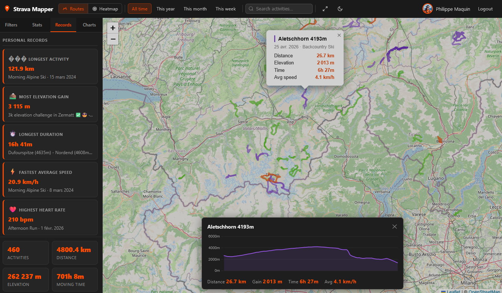

# Strava Mapper

Visualize every Strava activity on a single interactive map. Runs locally with Node.js/Express or deploys to **Cloudflare Pages** as a fully serverless app — no database required.



## Features

- **Interactive map** — all GPS routes rendered with [Leaflet](https://leafletjs.com/), color-coded by activity type (run, ride, hike, ski, swim, …)
- **Heatmap mode** — toggle a density heatmap overlay across all routes
- **Progressive loading** — activities fetched page by page with a live progress bar; automatic rate-limit retry
- **Activity popups** — click any route to see name, date, distance, elevation gain, and average speed
- **Real elevation profile** — clicking a route fetches the actual altitude stream from Strava and renders an interactive Chart.js elevation chart
- **Type filter legend** — toggle individual activity types on/off directly on the map
- **Date presets** — filter by All time, This year, This month, or This week
- **Search** — filter activities by name or type
- **Persistent stats** — total activities, distance, elevation, and moving time, always visible at the bottom of the sidebar
- **Personal records** — longest activity, most elevation gain, longest duration (elapsed time), fastest average speed, highest heart rate
- **Monthly distance chart** — Chart.js bar chart by month with a year selector
- **Activity calendar** — 52-week GitHub-style heatmap calendar
- **Dark / light theme** — toggle persisted in `localStorage`, defaults to dark
- **Guided setup page** — step-by-step instructions to create a Strava API app shown automatically when credentials are missing
- **Cloudflare Pages ready** — serverless functions, AES-GCM encrypted cookie sessions, no server-side storage needed

---

## Project structure

```
strava-mapper/
├── public/                      # Static assets (served as-is by CF Pages / Express)
│   ├── index.html               # Setup / landing page
│   ├── map.html                 # Main app (map + sidebar + elevation panel)
│   ├── css/style.css            # Dark/light theme, full layout
│   ├── js/
│   │   └── map.js               # All client-side logic
│   ├── leaflet/                 # Generated by npm run build (gitignored)
│   └── vendor/
│       ├── leaflet.heat.js      # Heatmap plugin (committed)
│       └── chart.umd.js         # Chart.js UMD build (generated, gitignored)
├── functions/                   # Cloudflare Pages Functions (serverless)
│   ├── _shared/
│   │   └── session.js           # AES-GCM encrypted cookie sessions
│   ├── api/
│   │   ├── config.js            # GET /api/config
│   │   ├── activities.js        # GET /api/activities
│   │   └── activity/
│   │       └── [id]/
│   │           └── streams.js   # GET /api/activity/:id/streams
│   ├── auth/
│   │   ├── strava.js            # GET /auth/strava  (OAuth start)
│   │   └── callback.js          # GET /auth/callback
│   └── logout.js                # GET /logout
├── scripts/
│   └── copy-leaflet.js          # Copies leaflet + chart.js → public/
├── server.js                    # Local Express server (not deployed to CF)
├── wrangler.toml                # Cloudflare Pages config
├── .env.example                 # Template for local Express dev
└── .dev.vars.example            # Template for local Wrangler dev
```

---

## Prerequisites

- [Node.js](https://nodejs.org/) 18+ (for local development)
- A free [Strava account](https://www.strava.com/)
- A [Cloudflare account](https://dash.cloudflare.com/) (for deployment only)

---

## 1 — Create a Strava API application

1. Go to [strava.com/settings/api](https://www.strava.com/settings/api) and log in.
2. Fill in the form:

   | Field | Value |
   |---|---|
   | Application Name | Strava Mapper (or anything) |
   | Category | Data Importer |
   | Website | `http://localhost` |
   | Authorization Callback Domain | `localhost` (local) or your domain (production) |

3. Click **Create** and note your **Client ID** and **Client Secret**.

---

## 2 — Local development

### Option A — Express server

```bash
git clone <repo-url>
cd strava-mapper
npm install          # also runs prepare → copies Leaflet

cp .env.example .env
# Edit .env and fill in your credentials:
#   STRAVA_CLIENT_ID=...
#   STRAVA_CLIENT_SECRET=...
#   SESSION_SECRET=any-long-random-string

npm start
# → http://localhost:3000
```

### Option B — Cloudflare Workers runtime (Wrangler)

Tests the exact same runtime as production.

```bash
npm install

cp .dev.vars.example .dev.vars
# Edit .dev.vars with your credentials (same fields as .env)

npm run dev:cf
# → http://localhost:8788
```

> In your Strava API app settings, add `localhost` as an authorized callback domain (it accepts both ports 3000 and 8788 under the same `localhost` entry).

---

## 3 — Deploy to Cloudflare Pages

### 3.1 Connect your repository

1. Push this repository to GitHub (or GitLab).
2. In the [Cloudflare dashboard](https://dash.cloudflare.com/), go to **Workers & Pages → Create → Pages → Connect to Git**.
3. Select your repository.

### 3.2 Build settings

| Setting | Value |
|---|---|
| Framework preset | None |
| Build command | `npm install` |
| Deploy command | `npm run build` |
| Build output directory | `public` |

`npm install` installs dependencies; the `prepare` hook then automatically copies Leaflet into `public/leaflet/`. `npm run build` runs the same copy script explicitly as the deploy step.

### 3.3 Environment variables (secrets)

In **Settings → Environment variables**, add the following as **encrypted secrets** for the *Production* environment (and optionally *Preview*):

| Variable | Description |
|---|---|
| `STRAVA_CLIENT_ID` | Numeric client ID from Strava |
| `STRAVA_CLIENT_SECRET` | Secret from Strava |
| `SESSION_SECRET` | Any long random string (used to encrypt session cookies) |

### 3.4 Update the Strava callback domain

In your Strava API app settings, set **Authorization Callback Domain** to your Pages domain (e.g. `strava-mapper.pages.dev`).

### 3.5 Deploy

Push to your main branch — Cloudflare Pages deploys automatically on every push.

---

## How it works

```
Browser → Cloudflare Pages (static HTML/CSS/JS)
              ↕ Pages Functions (serverless, Workers runtime)
                    ↕ Strava API  (OAuth 2.0 + activity data)
```

Sessions are stored entirely in an **AES-GCM encrypted httpOnly cookie** using the Web Crypto API — no database or KV store required. The Express server (`server.js`) is only used for local development and is never deployed.

---

## Available scripts

| Command | Description |
|---|---|
| `npm start` | Start Express server (local, uses `.env`) |
| `npm run dev` | Start Express with auto-reload via nodemon |
| `npm run dev:cf` | Start Wrangler dev server (local, uses `.dev.vars`) |
| `npm run build` | Copy Leaflet to `public/leaflet/` |
| `npm run deploy` | Deploy to Cloudflare Pages via CLI |

---

## Security notes

- The app only requests **read-only** Strava scopes (`read`, `activity:read_all`) — nothing is ever written to your account.
- Session cookies are `HttpOnly`, `SameSite=Lax`, and AES-256-GCM encrypted.
- CSRF is prevented on the OAuth flow using a state parameter validated against a short-lived cookie.
- `SESSION_SECRET` should be a cryptographically random string of at least 32 characters.

---

## License

MIT
